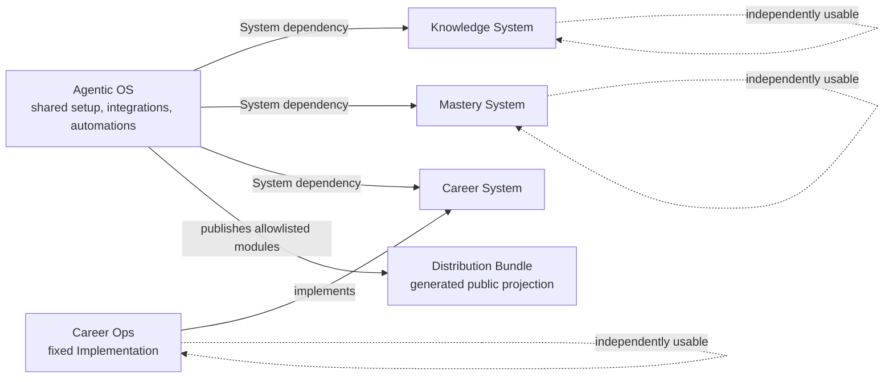

# Agentic Constellation

This map is intentionally low resolution. It records ownership and composition,
not System internals, provider details, installation state, or release versions.

Agentic OS composes Systems only through their public contracts. Setup ordering is
a setup dependency, not ownership. Cross-System calls are integration dependencies,
not permission to store another System's domain model or operational state here.
